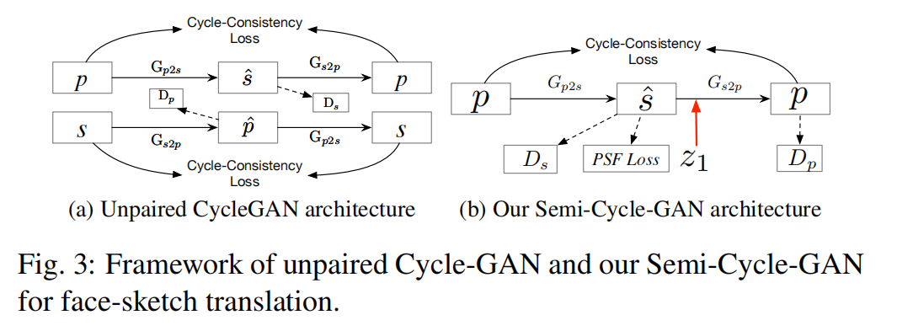
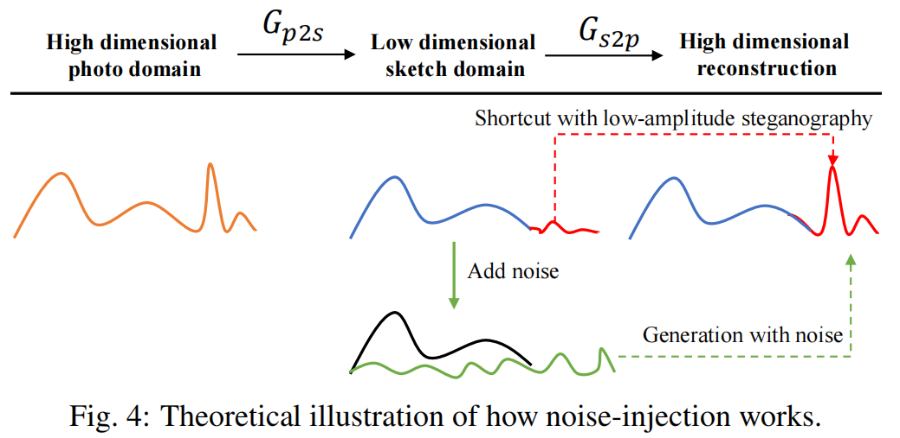
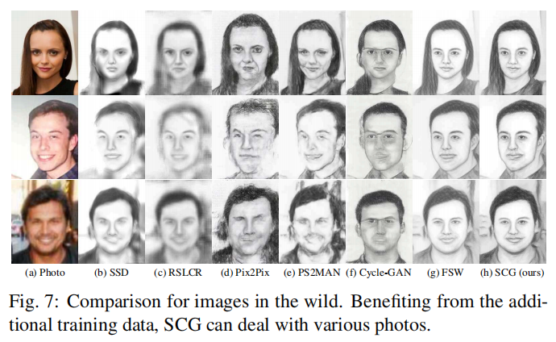
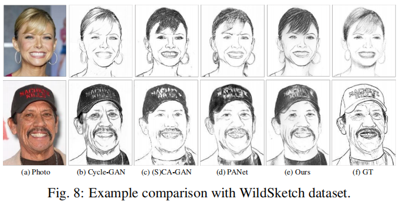

# Face-Sketch-SCG

This is the official PyTorch codes for the journal extension of our [previous work](https://github.com/chaofengc/Face-Sketch-Wild): 

[**Semi-supervised Cycle-GAN for face photo-sketch translation in the wild.**](https://arxiv.org/abs/2307.10281)  
[Chaofeng Chen](https://chaofengc.github.io), [Wei Liu](https://scholar.google.com/citations?user=3to3lqMAAAAJ&hl=en), [Xiao Tan](https://scholar.google.com/citations?user=R1rVRUkAAAAJ&hl=en), [Kwan-Yee K. Wong](http://i.cs.hku.hk/~kykwong/)  

[](https://arxiv.org/abs/2307.10281)

[](https://github.com/chaofengc/Face-Sketch-SCG/blob/master/README.md#-citation)
[](https://github.com/chaofengc/Face-Sketch-SCG/blob/master/LICENSE)

| Framework | Noise-injection |
| :-----: | :------: |
|  |  |

# ⚙️ Dependencies Configuration 
- PyTorch >= 1.8.0
- CUDA >= 10.1
- Install other dependencies with
  ```
  # git clone this repository
  git clone https://github.com/chaofengc/Face-Sketch-SCG.git
  cd Face-Sketch-SCG 

  # create new anaconda env
  conda create -n sketch python=3.8
  source activate sketch 

  # install python dependencies
  pip3 install -r requirements.txt
  ```

# ⚡ Quick Test

You may test with **aligned** face images using the following command:
```
python test.py -i ./test_images -o results/ --direction AtoB
```
The available options are
name | default | description 
--- | --- | --- 
-i, --input | | input image path or folder path
-o, --output | `results` | output folder path
-s, --style | `cufs` | sketch styles: `cufs, cufsf, wildsketch` 
-d, --direction | `AtoB` | `AtoB`: RGB to gray sketch; `BtoA`: gray sketch to RGB 
-w, --weight| `None` | custom weight path
-g, --ground_truth | `None` | ground truth images for calculating metrics: fsim, lpips, dists

## 🖼️ Example Results




## 📊 Performance on Public Benchmarks

Because we improve the training details after cleaning the codes, results of the released models are slightly different from numbers in the paper:

Datasets | CUFS (FSIM↑/LPIPS↓/DISTS↓) | CUFSF (FSIM↑/LPIPS↓/DISTS↓) | WildSketch (FSIM↑/LPIPS↓/DISTS↓) |
--- | --- | --- | ---
Paper Results (AtoB) | 0.7343/0.3232/0.1967 | 0.7261/0.3489/0.184 | 0.7010/-/-
Released | 0.7349/0.3140/0.1875 | 0.7258/0.3473/0.1777 | 0.7010/0.3165/0.2528
Paper Results (BtoA) | 0.7652/0.3374/0.1710 | 0.7777/0.3527/0.2082 | N/A 
Released | 0.7789/0.2874/0.1633 | 0.7816/0.3592/0.2229 | N/A

Here is the example benchmark test script for photo-to-sketch (AtoB) with CUFS dataset:
```
python test.py -i ./dataset/CUFS/test_photos/ -o tmp_test_results -s cufs -d AtoB -g ./dataset/CUFS/test_sketches/
```

# 🛠️ Train the Model

You may first download the datasets and use the provided example script to train the model.
## ⏬ Download Datasets
For convenient, we put all the training dataset [here](https://github.com/chaofengc/Face-Sketch-SCG/releases/tag/v0.1). Please download and extract them under the `dataset/` folder. You may also download the dataset with the following commands:
```
wget https://github.com/chaofengc/Face-Sketch-SCG/releases/download/v0.1/dataset.tgz
``` 

## 👩🏻‍💻 Train Commands 

Here is an example training command with `cufs` as reference dataset: 
```
python train.py --gpus 1 --name FaceSCG_v001 --model semicycle_gan --total_epochs 100 \
    --lr 0.002 --beta1 0.9 \
    --lr_policy 'cosine' --n_epochs 20 \
    --Gnorm "gn" --Dnorm "gn" --act_type silu --n_layers_D 3 --D_num 3 \
    --lambda_mrf 1 --lambda_sty 1 --lambda_g 1 --lambda_A 1 --lambda_pcp 1 --sigma 20 --patch_k 3 \
    --train_style cufs --vggface ./dataset/vggface \
    --dataset_name fsvgg --batch_size 4 --Gin_size 256 --topk 3 \
    --visual_freq 50 --print_freq 10 --save_iter_freq 200 --save_latest_freq 100 
```
Please refer to the codes for details of these options.

# 📑 Citation

If you find this code or the provided data useful in your research, please consider cite:
```
@inproceedings{chen2023face-sketch-scg,
    title={Semi-supervised Cycle-GAN for face photo-sketch translation in the wild},
    author={Chen, Chaofeng and Liu, Wei and Tan, Xiao and Wong, Kwan-Yee~K},
    booktitle={Computer Vision and Image Understanding (CVIU)},
    year={2023},
    doi={https://doi.org/10.1016/j.cviu.2023.103775},
}
```

# 📜 License

This work is licensed under a <a rel="license" href="http://creativecommons.org/licenses/by-nc-sa/4.0/">Creative Commons Attribution-NonCommercial-ShareAlike 4.0 International License</a>.  
<a rel="license" href="http://creativecommons.org/licenses/by-nc-sa/4.0/"></a>
